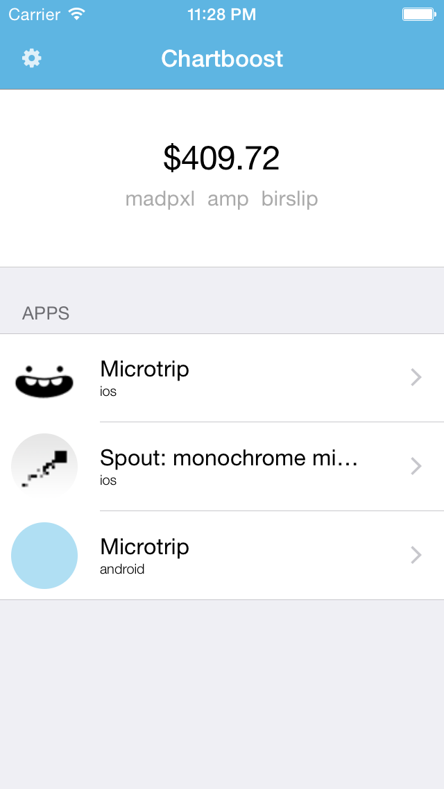
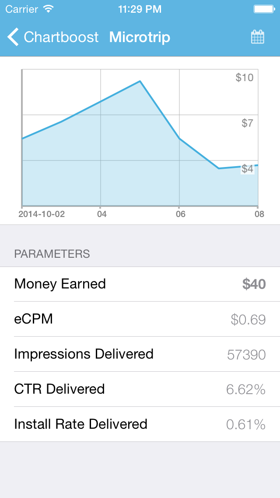
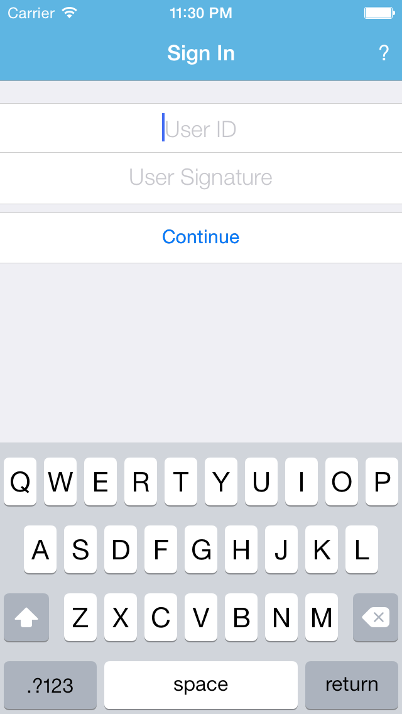

ChartLoot
=========

A simple iOS client for Chartboost.

Screenshots
---
&nbsp;
&nbsp;




About
---
As you can see ChartLoot is an iOS client for the Chartboost API. It's also a real life example on how to use FSLineChart.

How to use
---
Install the dependancies using the cocoapods command:

```objc
pod install
```

Then open the workspace with xcode and it should work! Don't forget that you can get your API keys [at this address](https://dashboard.chartboost.com/api-explorer).